## About Me

I'm a data engineer who builds systems that move and transform large amounts of data. Currently working with pipelines processing 5M+ records, optimizing Spark jobs, and designing AWS data infrastructure.

**Education:** BSc Computer Science, 3.57/4.0  
**Location:** Cairo, Egypt (open to remote)

```python
class DataEngineer:
    def __init__(self):
        self.name = "Marwa Elhussieny"
        self.focus = [
            "ETL pipeline architecture",
            "Distributed data processing", 
            "Cloud data infrastructure",
            "Real-time streaming"
        ]
        
    def get_stack(self):
        return {
            "processing": ["Apache Spark", "Apache Airflow", "Kafka"],
            "cloud": ["AWS S3", "Glue", "Redshift", "Lambda"],
            "languages": ["Python", "SQL"],
            "databases": ["Oracle", "PostgreSQL", "MySQL"],
            "tools": ["Docker", "Git", "Power BI"]
        }
```

---

## Recent Projects

<table>
<tr>
<td width="50%">

### Enterprise Data Warehouse
Built using Kimball methodology with star schema design. Airflow orchestrates ETL workflows processing 5M+ records with incremental loading and data quality validation.

**Stack:** Airflow, PostgreSQL, Python

</td>
<td width="50%">

### Spark Pipeline Optimization  
Rewrote batch processing pipeline with improved transformations and partitioning. Reduced runtime by 70%, now handles 2M+ daily records.

**Stack:** Apache Spark, Python, Parquet

</td>
</tr>
<tr>
<td width="50%">

### AWS Serverless Architecture
Serverless data pipeline using S3, Glue, Lambda, and Redshift. Infrastructure-as-code approach for automated data ingestion and transformation.

**Stack:** AWS, Lambda, Redshift, Python

</td>
<td width="50%">

### Analytics Dashboard Suite
Power BI dashboards with real-time refresh and custom DAX measures. Provides actionable business metrics used daily by stakeholders.

**Stack:** Power BI, DAX, SQL

</td>
</tr>
</table>

---

## Currently Learning

Real-time data streaming with Apache Kafka • Advanced Spark optimization • ML pipeline integration • Kubernetes orchestration

---

## Get in Touch

I'm open to discussing data engineering challenges, ETL best practices, or collaboration opportunities.

<div align="center">

[](https://linkedin.com/in/marwa-elhussieny)
[](mailto:marwaelhussieny17@gmail.com)
[](https://github.com/marwa-elhussieny)

**Available for data engineering roles and internships**

</div>
